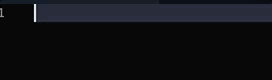
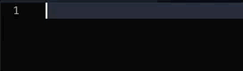
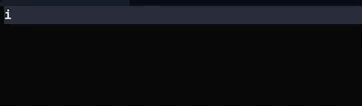
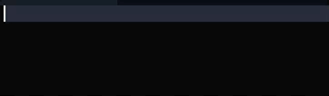
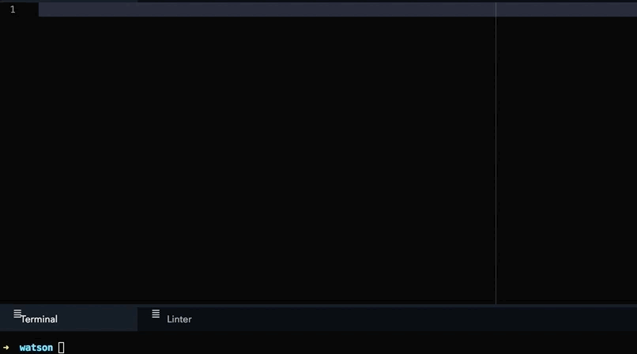
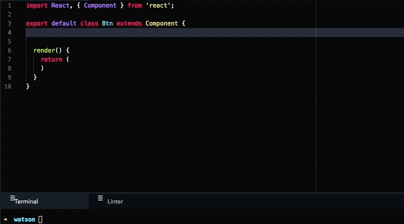
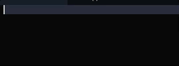

# es6-react-redux-snippets
This is the best package ever created for ES6, React and Redux.

Enjoy :D

## ES6+ Snippets

**log → console.log()**
 

**anfn → annonymous function**
 

**nfn→ named function**
 

**fn → ES5 fucntion**
 

**imp → import statement**
 

**imd → import statement desctructured**
 

**ime → import everything as**
 

**fof → for of loop**
 

**fin → for in loop**
 

**met → method**
 

**seto → setTimeout**
 

**npro → new Promise**
 

**catch → catch() with nested annonymous function**
 

**then → then() with nested annonymous function**
 

## React Snippets

**rcc → React Class Based Component**
 

**cpwm → | componentWillMount Method**
 

## React Redux Snippets

**rcredux → Renders a React connected component**
 

**mapSta → mapStateToProps function**
 

**mapDis → mapDispatchToProps**
 

## Redux Snippets

**rxconst → creates redux constant**
 

**rxaction → redux action**
 

**rxreducer → Redux reducer template**
 

